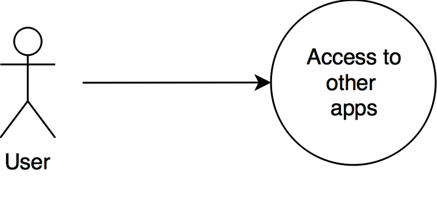

# Universo Specs

Current version: `0.0.1-a`

## Description

- User can see all the applications of the system. In this state, the citizen see **clickable icons for each application** made of an **icon** with a **label** for the name of the application.
- User can click on the application to be redirected to it.

## User path

### Components

#### Applications Grid

- Grid of apps with icon and label;

## Wireframes

:warning: *In progress*

## Mockups

:warning: *In progress*
